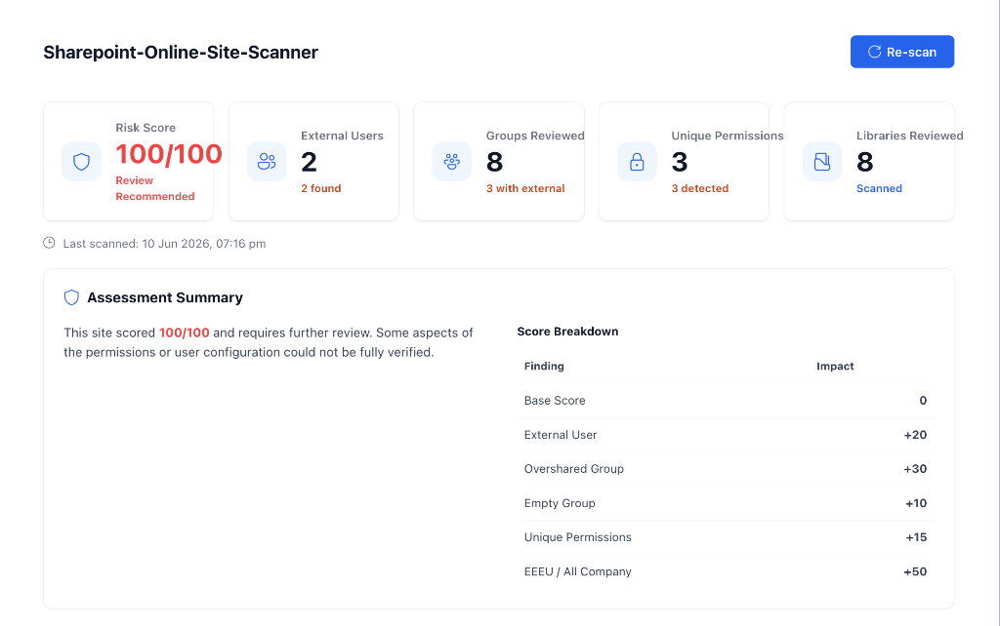
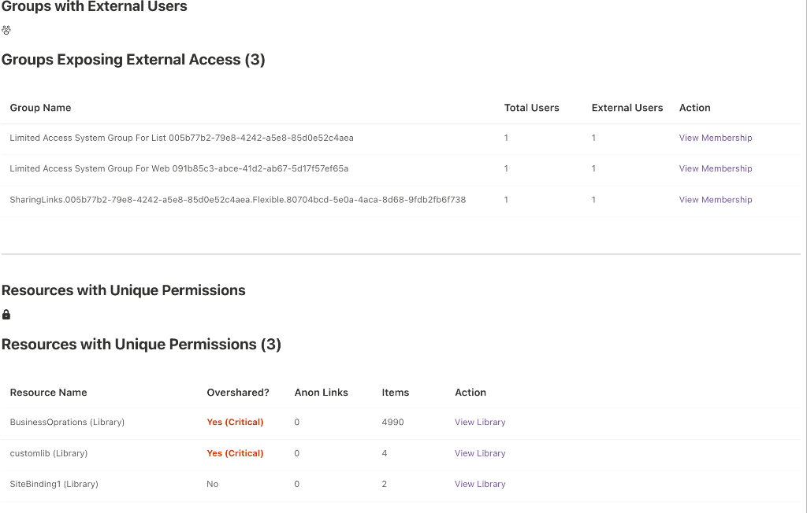
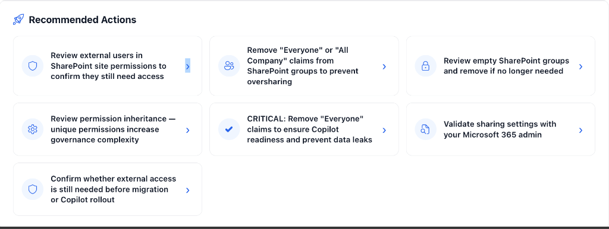

# SharePoint Site Scanner


An open-source SharePoint Framework web part for reviewing external sharing, SharePoint group membership, permission inheritance, Copilot readiness, and governance risk indicators in SharePoint Online.

This project is designed to help SharePoint site owners, Microsoft 365 admins, consultants, and developers quickly surface common permission and external sharing risks directly from a SharePoint site—**without needing global Graph API consent.**

> [!TIP]
> **Love this project?** Please consider giving it a ⭐ **Star** and **Forking** it on GitHub! 
> If you have ideas, feature requests, or want to collaborate, drop a message in the **GitHub Discussions** tab.


---

## Screenshots

### Unified Risk Dashboard


### Detailed Governance Tables


### Recommended Action Plan


---

## Overview

External sharing is useful in SharePoint Online, but it can become difficult to review as sites, libraries, folders, files, guests, and sharing links grow over time.

Many organizations do not struggle because external sharing exists. They struggle because it becomes hard to answer practical governance questions such as:

- Are there external users with access to this site?
- Are SharePoint groups empty, outdated, or overshared with "Everyone"?
- Are document libraries using unique permissions?
- Are active Anonymous (Anyone) links scattered across files?
- Does this site need a governance review before migration, Copilot rollout, or broader content modernization?

The SharePoint Site Scanner provides a lightweight, highly visual dashboard that helps start those conversations immediately.

---

## Key Features

- **No Graph API Required**: Operates entirely within the logged-in user's context using the native SharePoint REST API via PnPjs. Zero tenant-admin API consent headaches!
- **SharePoint Site-level Risk Summary**: Calculates a determinisic risk score out of 100 based on detected permission vulnerabilities.
- **Multiple UI Themes**: Choose between `Unified` (all-in-one report), `Modern` (tabbed), and `Compact` (summarized) dashboard layouts.
- **Copilot Readiness Check**: Actively flags libraries that are overshared with "Everyone except external users" (EEEU) or "All Company" to prevent AI data leaks.
- **Item-Level Anonymous Link Detection**: Specifically identifies which files contain active Anonymous sharing links so you can revoke them instantly.
- **Customizable Weights**: Fully configurable Web Part Properties allow you to fine-tune exactly how heavily each risk factor impacts your total score.

---

## Prerequisites

To install and run this Web Part, you will need:

1. **SharePoint Admin / Site Owner Access**: You need sufficient permissions on the target SharePoint Site to read list items and role assignments.
2. **App Catalog**: Access to a SharePoint App Catalog to upload the `.sppkg` package.
3. **No Special API Permissions**: Because this solution relies entirely on the local SharePoint REST API (`_sp.web`) under the current user's context, **you do NOT need to grant broad Microsoft Graph API permissions (like `Sites.Read.All`)**.

---

## Risk Scoring: The 100% Bucket Model

The scanner uses a strictly mathematical percentage-based risk score (0-100%). The total score is divided into **four configurable buckets**. 

By default, the buckets are weighted against industry standards for Copilot/AI data risk, but you can adjust these weights in the **Web Part Properties**. The property pane includes real-time validation to ensure your custom weights always sum perfectly to 100%.

### 1. Copilot Data Leak / Oversharing Risk (Default: 40%)
The highest priority risk vector for AI data leaks.
- **Critical Penalty**: Triggered if the site role assignments natively expose data to "Everyone except external users" or "All Company".
- **Group Penalty**: Triggered for *each* SharePoint group containing an "Everyone" claim.

### 2. External User Risk (Default: 30%)
Evaluates the exposure of the site to external guest users.
- **Exposure Penalty**: Triggered if external users are detected on the site.
- **Privilege Penalty**: Heavy penalties applied if external users are placed inside "Owner" or "Member" groups, violating Least Privilege.

### 3. File Sharing & Permission Risk (Default: 20%)
Evaluates the complexity of item-level permissions.
- **Unique Permissions**: Triggered if the site or any document library has broken permission inheritance.
- **Anonymous Links**: Penalties scale for *each* active "Anyone with the link" (Anonymous) sharing link detected on a file.

### 4. Governance Hygiene (Default: 10%)
Evaluates stale data and unmanaged access.
- **Stale Data**: Triggered for document libraries that have not been modified in over 2 years (reduces Copilot search accuracy).
- **Empty Groups**: Triggered for empty SharePoint groups, indicating stale or unmanaged permissions.


---

## Current Limitations

While this tool is highly capable of surfacing risks, it is designed as a **basic governance visibility tool** for individual site owners, not a tenant-wide audit replacement. Please be aware of the following scope boundaries:

- **External User Detection**: Detection relies on heuristic signals (like `#EXT#` and domain checking) rather than Entra ID directory scanning. False positives (internal service accounts) and false negatives (hidden guests) are possible.
- **Permission Depth**: While the scanner detects broken inheritance and anonymous links, it does not recursively enumerate *what* every unique permission is or check folder-level nuances.
- **Performance**: The scanner fetches real-time data upon page load. It is designed for typical team sites (< 1000 users). It may perform slowly on excessively large legacy sites.
- **Scope**: This Web Part operates strictly at the **Site** level. It cannot scan your entire Microsoft 365 tenant at once. For tenant-wide compliance, use Microsoft Purview or the SharePoint Admin Center.

---

## Local Development

Use the latest supported SharePoint Framework toolchain for new development (SPFx 1.22.x, Node.js v22 LTS).

Clone the repository:

```bash
git clone https://github.com/Vishnu/spfx-external-sharing-risk-scanner.git
cd spfx-external-sharing-risk-scanner
```

Install dependencies:

```bash
npm install
```

Run the local development server:

```bash
gulp serve
```

---

## Deployment

To deploy the web part to SharePoint Online:

1. Run a production bundle:

```bash
gulp bundle --ship
```

2. Package the solution:

```bash
gulp package-solution --ship
```

3. Locate the generated `.sppkg` file in: `sharepoint/solution/external-sharing-risk-scanner.sppkg`

4. Upload the `.sppkg` file to your SharePoint App Catalog.

5. Add the app to your target SharePoint site and place the Web Part on a page.

6. Edit the Web Part properties to configure internal domains and adjust the risk scoring weights to match your organization's security posture.

---

## Permissions and Safety

This project should be reviewed carefully before use in any production environment.

- **Runs in User Context**: The Web Part can only scan libraries and permissions that the currently logged-in user has access to read.
- **Read-Only**: The scanner makes absolutely no modifications to site permissions or groups. It is strictly a reporting tool.
- Test in a development tenant first.
- Confirm the solution matches your organization's governance policies.

---

## Disclaimer

This project is provided as a technical sample and governance helper for SharePoint Online and Microsoft 365 environments.

This project does not replace a formal Microsoft 365 security review, compliance review, legal review, or governance assessment. Use this project at your own discretion and validate all findings in your own environment.

---

## About

Created by Vishnu.

I build practical SharePoint, Microsoft 365, and SPFx solutions focused on governance, permissions, migrations, intranet solutions, automation, and real enterprise problems.

Portfolio: https://www.wrvishnu.com
Contact: https://www.wrvishnu.com/contact
